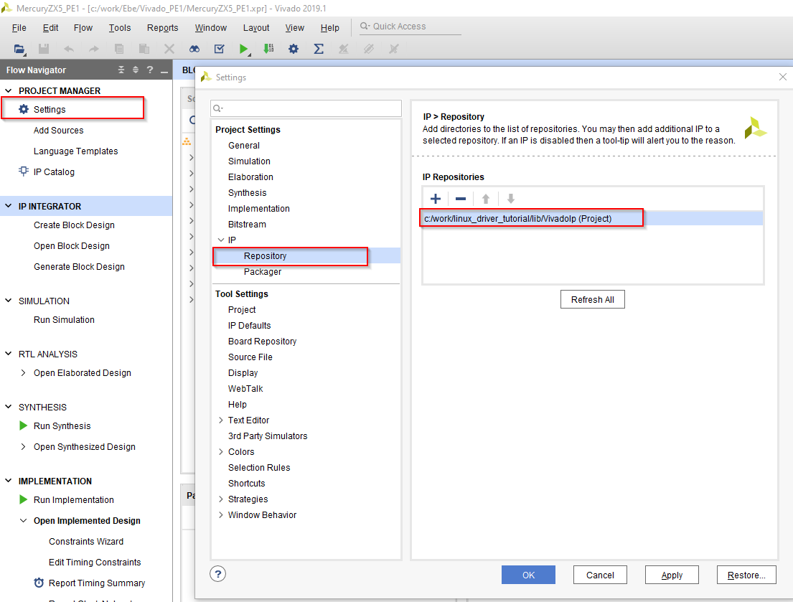
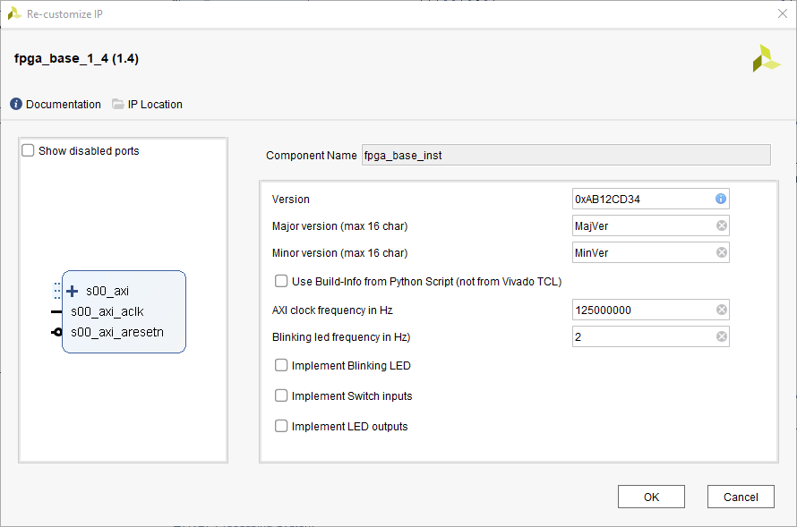
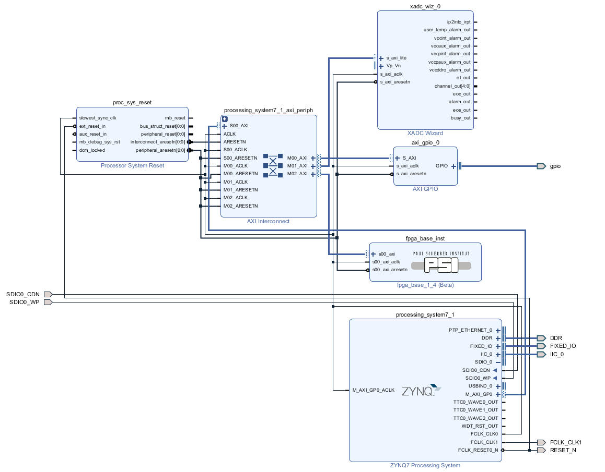
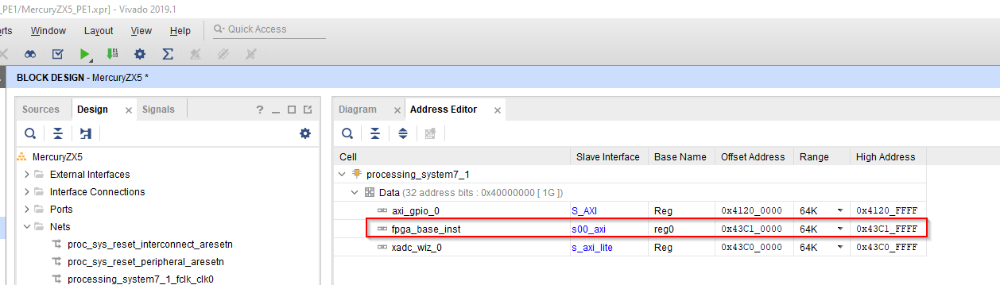
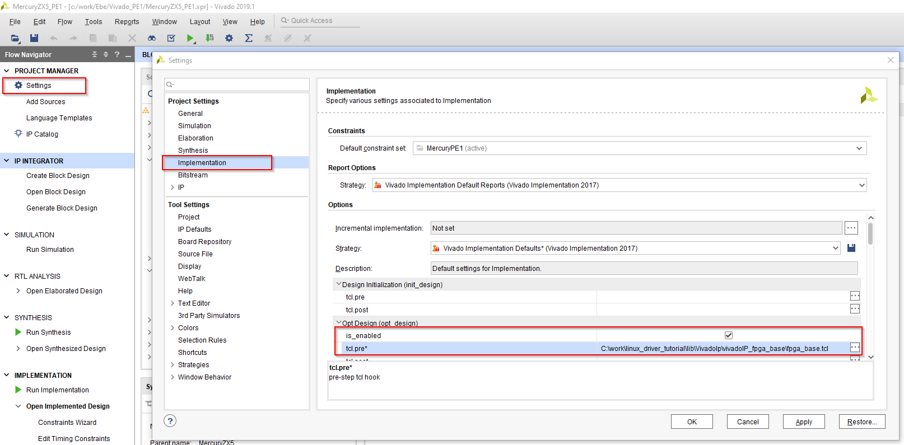
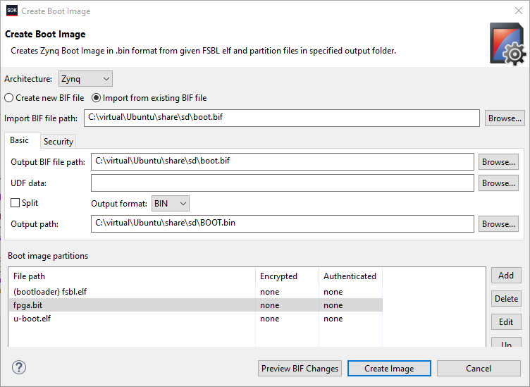
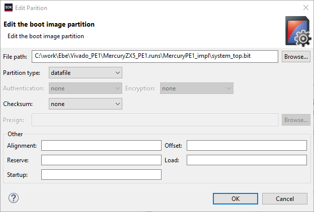

[<< back](02_introduction.md) | [index](01_index.md) | [forward >> ](04_devmem.md)

# Setup

## 1. Get the Reference Desgin

First of all, the reference design of the target HW has to be downloaded from the *Enclustra Download Page [3]*. In our case, this is the *[Mercury ZX5 Reference Design for Mercury PE1 V4](https://download.enclustra.com/public_files/SoC_Modules/Mercury_ZX5/Mercury_ZX5_Reference_Design_for_Mercury_PE1_V4.zip) [4]*. Download the zip and extract it somewhere to your hard-drive.

## 2. Reference Design Setup

The reference design downloaded in step 1 contains a good description about how to set-up the hardware, what tools are required and how to build the reference design. I suggest you follow these steps to ensure you can successfully build the reference design on your machine.

## 3. Enclustra Linux Build Environment

Follow the [Enclustra Build Environment - HowTo Guide](https://download.enclustra.com/public_files/Design_Support/Application%20Notes/Enclustra_Build_Environment_HowToGuide_V02.pdf) to generate a bootable Linux and test it. This is where we start from (the tutorial does not cover the process of building a bootable Linux).

Note that the tutorial assumes you are booting from SD card. You can choose other boot mechanisms but the descriptions will not fit one-to-one in this case.

## 4. Add the *fpga_base* IP-Core

First, add the path containing the IP-core (*[repoRoot]/lib/VivadoIp*) to the IP search path of the reference design Vivado project. 

Now follow the steps below:

1. Open the block design (click on *Open Block Design*)
2. Right-click into the block design
3. Select *Add IP* from the context menu
4. Type *fpga_base* and select the *fpga_Base_1_4* IP-Core
5. The new IP-Corere should now be visible in the block design.

Now doubble-click on the new IP-core and configure it as shown in the picture below.

Now integrate the IP-Core into the design:

1. Add an additional master port to the AXI Interconnect
2. Connect the *fpga_base* IP core to the AXI interconnect
3. Connect clock and reset of *fpga_base*
4. Connect clock and reset of the new AXI Interconnect port

The block design should now look like this:

Now assign the address *0x43C10000* to the new IP-Core. You could use any other address but all examples will contain this address.

In order to automatically set the bitstream build date in the registers of the *fpga_base* IP-core, a TCL script to be run by Vivado during the implementation phase of the design must be registered. Do not skip this step because otherwise, you will not be able to read a date from the IP-Core as it is expected be furthers steps of this tutorial.

You can now generate a new bitstream by clicking on *Generate Bitstream*

## 5. Add the new Bitstream to Linux Boot

To make Linux booting the new bitstream, follow the steps below:

1. Open Xilinx SDK
2. Click on *Xilinx > Create Boot Image*
3. Select *Importexisting BIF file*
4. From the *Browse* buttopn next to the *Import BIF file path*, select the .bif file that was generated by Enclustra Build Environment together with the other files to be placed in the boot partition.
5. After following these steps, the dialog should roughly look as shown below

Now click on the *fpga.bit* partition of the boot image and select *Edit*. Choose the .bit file generated by Vivado  (see figure below for the default path of the file) and press OK.

Now press the *Create Image* button in the boot image dialog and accept overwriting existing files. 

## 6. Copy files to SD-Card

Now copy the new *boot.bif* and *boot.bin* files to the boot partition of your SD card and check if it still boots.

At that point we have a new peripheral in the PL but we cannot access it.

[<< back](02_introduction.md) | [index](01_index.md) | [forward >> ](04_devmem.md)