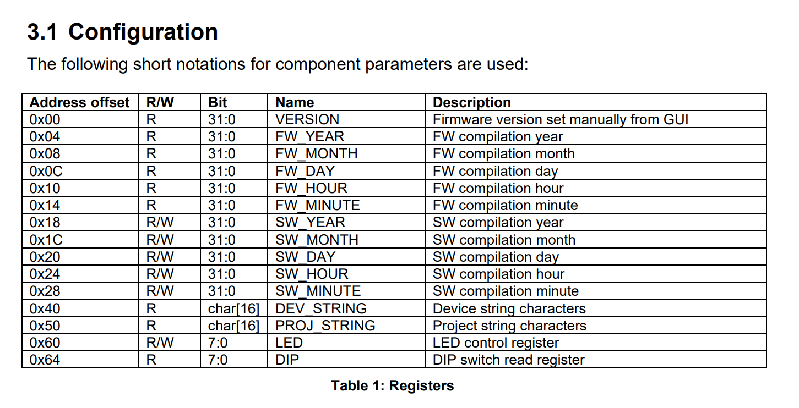
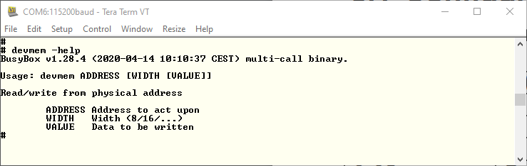
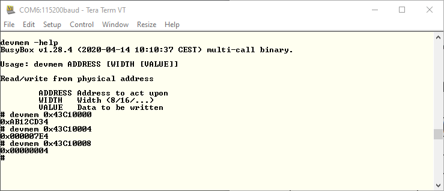
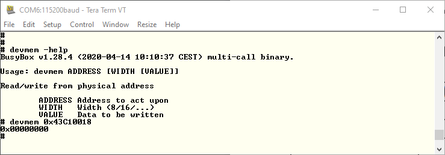
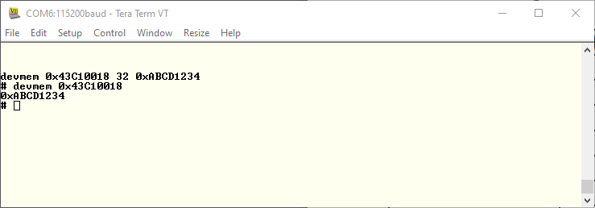

[<< back](03_setup.md) | [index](01_index.md) | [forward >> ](05_uio_driver.md)

# devmem

## Overview

We now have a bitstream we assume to get loaded during the boot process. However, we should prove that the bitstream is really loaded and that we can access our peripheral before we go writing drivers for it. To do this, *devmem* can be used.

## 1. Finding out about the IP-Core

First of all, we need to know how the register bank of the IP-Core looks. Otherwise we cannot have any expectations of how to interact with it. 

To find out about the register bank of the IP-Core, open the document [[root]/lib/VivadoIp/vivadoIP_fpga_base/doc/fpga_base.pdf](https://github.com/paulscherrerinstitute/vivadoIP_fpga_base/blob/master/doc/fpga_base.pdf) and jump to page 5.

Okay, so we expect to read the version configured in the Vivado GUI (in our case 0xAB12CD34) from address 0x00. In the registers after the version, we expect to read the FW build date. 

The SW build date may be a bit confusting. How can the FW know about this? Actually these are just read/write registers. They are meant to be set by the processor of an embedded system and to be read by the control system. In our case, we can just see them as read/write registers.

## 2. Find out about devmem

To find out about the devmem command, type *devmem -help* on the shell of your target Linux.

## 3. Read Registers

Now you can read the version and FW date registers using devmem. Note that the offset of the IP-Core address (0x43C10000) has to be taken into account.

We can see the expected version. The build year/month also seem to be correct. I built the design in April 2020. So month number 4 and Year 0x7E4=2020 are correct.

## 4. Write Registers

For the registers that must be written by SW, we still read zero of course, because they were not written at any point.

Let's try writing and reading them back:

Okay, this seems to work. We read back the value we wrote.

## 5. Conclusion

The IP core we added to the design is accessible and it works as expected. Hence, we can now continue writing a driver for the IP-Core.

[<< back](03_setup.md) | [index](01_index.md) | [forward >> ](05_uio_driver.md)
