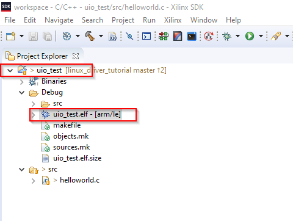

[<< back](04_devmem.md) | [index](01_index.md) | [forward >> ](06_ioctl_driver.md)

# UIO Driver

## Overview

Writing a Linux driver always imposes the risk of crashing the whole kernel. Additionally drivers are hard to debug, so whenever possible, writing kernel code should be avoided.

In order to achieve this, Linux provides a generalized user-space I/O driver (UIO). The idea is to move the logic of the driver itself into the user space and only have a very simple kernel module that tells the generalized driver which addresses etc. to use.

## 1. Edit Device Tree

First we have to let linux know, that there is a UIO device and at which addresses it is. To do so, the device tree of the reference design must be edited.

Details about location of devicetree files, how to build them, etc. can be found in the  *[nclustra Build Environment - HowTo Guide](https://download.enclustra.com/public_files/Design_Support/Application%20Notes/Enclustra_Build_Environment_HowToGuide_V02.pdf)[2]*

In our case, we add the section below:

<pre>
    uio_fpga_base@43C10000{	
		status = "okay";
		compatible = "generic-uio";
		reg = < 0x43C10000 0x1000 >;
	};
</pre>

The full device-tree file is available in [[root]/uio_driver/zx5-obru-uio.dts](../uio_driver/zx5-obru-uio.dts)

## 2. Compile Device Tree

The easiest way to compile the edited devicetree, is copying it to the folder *[root]/bsp-xilinx/sources/xilinx-linux/arch/arm/boot/dts* directory of your Enclustra Build Environment.

The device-tree can then be compiled into a devicetree-blob using the command below (from within the *dts* drectiory mentioned above):

<pre>
dtc -O dtb -o zx5-obru-uio.dtb zx5-obru-uio.dts
</pre>

The output file *zx5-obru-uio.dts* must be copied to the boot partition of the SD card and renamed to *devicetree.dtb* (as expected by the boot process) and hence replace de default *devicetree.dtb* file.

## 3. Write Kernel Module

A very small kernel module is required. It is only there to let the generic UIO driver know about the properties of the device (base address, interrupt number, etc.). 

The code for this kernel module can be found in [[root]/uio_driver/fpga_base.c](../uio_driver/fpga_base.c). Note that the current version of the example code does not contain any interrupt support yet.

## 4. Compile Kernel Module

The details about how to build kernel modules for the Enclustra Embedded Build Environment are explained in *[Enclustra Build Environment - HowTo Guide](https://download.enclustra.com/public_files/Design_Support/Application%20Notes/Enclustra_Build_Environment_HowToGuide_V02.pdf) [2]*. 

A small script allowing building a driver with a single command is provided: [[root]/uio_driver/compile.sh](../uio_driver/compile.sh). The script is of course closely related to the makefile [[root]/uio_driver/Makefile](../uio_driver/Makefile). 

**Note that you must edit the _BSP_XILINX_ variable in the _compile.sh_ script to match your system before building the driver.**

To build the driver, just navigate to the *[root]/uio_driver* directory and execute the follwoing command:

<pre>
    ./compile.sh
</pre>

Now copy the *fpga_base.ko* kernel object file to the directory */root/uio_driver* of your SD Card (*rootfs* partition).

## 5. Loading Kernel Module

Follow the steps below to load the kernel module:

Boot the target device.

Then navigate to the correct directory on your *rootfs* ...

<pre>
    cd /root/uio_driver
</pre>

... and load the module

<pre>
    insmod fpga_base.ko
</pre>

You should now see a new device named *uio0* popping up in the */dev* folder. Note that UIO devices do not have a readable name but they are numbered starting at zero. This is not very handy. However, there are ways to acquire more information. These are described below.

## 6. Getting Information about a UIO Device

The plain numbering of UIO devices without a human readable name can easily lead to confusion. Luckily, there are some ways to find out more about a UIO device.

One way to learn more about UIO devices is suing the */sys/class/uio* directory structure. For example:

<pre>
    #cat /sys/class/uio/uio0/name
    fpga_base
</pre>

Another even more handy way, is the *lsuio* utility. It is not enabled by default but it can easily be enabled when configuring buildroot. Just search (using '/') for "lsuio" and enable the corresponding package. If *lsuio* is present you can use it as described below:

<pre>
    # lsuio
    uio0: name=fpga_base, version=1.0, events=0
            mape[0]: addr=0x43C10000, size=4096
</pre>

## 7. Writing a User Space Application

A small user space application is provided along with the example in order to show how to use the UIO driver from user space. The application is provided as *Xilinx SDK* project. The source file can be found in [[root]/uio_driver/app/src/helloworld.c](../uio_driver/app/src/helloworld.c).

The program only has a hand full of lines and explanatory comments. So it is not described here in more detail. Just have a look at the sources.

To build the application, follow the steps below:

1. Start SDK
2. Create/choose an empty workspace
3. Click *File > Import*
4. Choose *General > Existing Projects into Workspace*
5. Select the folder *[root]/uio_driver*
6. Press *Finish*

In SDK you should now see a project called *uio_test*. By default SDK should automatically build the project and produce a *.elf file. If you disabled automatic build in SDK, you have to manually build the project using *Project > Build All*.

Now copy the *uio_test.elf*  file to the directory */root/uio_driver* of your SD Card (*rootfs* partition).

## 8. Test User Space Application

Follow the steps below to load the kernel module:

Boot the target device.

Then navigate to the correct directory on your *rootfs* ...

<pre>
    cd /root/uio_driver
</pre>

... and start the application. Before, the UIO driver must be loaded of course.

<pre>
    insmod ./fpga_base.ko
    ./uio_test.elf
</pre>

You should now see the following output:

<pre>
    Hello World
    version=0xAB12CD34
    year=2020
    sw-version=0x0000ABCD
</pre>

Note that the "year" output may change according to the year you built the FPGA bitstream in.

## 9. Conclusion

In this chapter, a simple UIO based device driver was built and installed. It was used from a very simple command line application.

Of course only the very simplest case of a driver is covered, but this should be a good starting point to base your own development of a real (and more complex) driver on.

[<< back](04_devmem.md) | [index](01_index.md) | [forward >> ](06_ioctl_driver.md)
