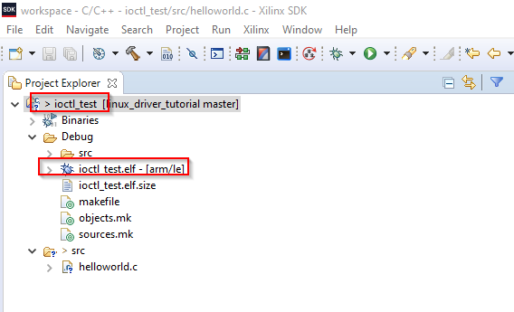

[<< back](05_uio_driver.md) | [index](01_index.md) | [forward >> ](99_references.md)

# IOCTL Driver

## Overview

If it comes to more complex driver operations and tight timing requirements, UIO drivers are quite limited because the logic runs in user space and cannot react on interrupts directly. Only within kernel drivers all the very performant features of the Linux kernel (e.g. queues) can be used to achieve maximal performance.

There are many different types of drivers you can choose from. However, the most common driver type is a character device with IOCTL operations. IOCTL operations allow passing an argument of any type. If a struct type is chosen, the number of input/output arguments is defined by the struct and hence practically unlimited.

As mentioned above, there are many different types of device drivers. We will implement a *misc device* because this is simpler than most other options. At the same time, it still gives us the freedom to act as character device with IOCTLs. A good article about the *misc device* can be found *[here](https://www.linuxjournal.com/article/2920) [6]*.

**The tutorial assumes you start on clean state generated by the Enclustra Build Environment, not on the state after the UIO Driver section**

## 1. Edit Device Tree

First we have to let Linux know about our device. To do so, we edit the devicetree.

Details about location of devicetree files, how to build them, etc. can be found in the  [Enclustra Build Environment - HowTo Guide](https://download.enclustra.com/public_files/Design_Support/Application%20Notes/Enclustra_Build_Environment_HowToGuide_V02.pdf)

In our case, we add the section below to the default devicetree:

<pre>
    fpga_base@43C10000{	
		status = "okay";
		compatible = "psi,fpga-base";
		reg = < 0x43C10000 0x1000 >;
		somevalue = < 0x9876 >;
	};
</pre>

The string assigned to *compatible* defines which driver to load. Each driver contains a list of such *compatible* strings it is compatible with. Linux will pair them (i.e. load a driver with matching string for each peripheral).

You may also wonder about the the line containing *somevalue*. This value does not have any meaning but is used to demonstrate how to pass information from the devicetree to the driver. In real-world this mechanism is used to pass information about the hardware to the driver.

The full device-tree file is available in [[root]/ioctl_driver/zx5-obru-uio.dts](../uio_driver/zx5-obru-ioctl.dts)

## 2. Compile Device Tree

The easiest way to compile the edited devicetree, is copying it to the folder *[root]/bsp-xilinx/sources/xilinx-linux/arch/arm/boot/dts* directory of your Enclustra Build Environment.

The device-tree can then be compiled into a devicetree-blob using the command below (from within the *dts* drectiory mentioned above):

<pre>
dtc -O dtb -o zx5-obru-ioctl.dtb zx5-obru-ioctl.dts
</pre>

The output file *zx5-obru-ioctl.dts* must be copied to the boot partition of the SD card and renamed to *devicetree.dtb* (as expected by the boot process) and hence replace de default *devicetree.dtb* file.

## 3. Write Kernel Module

In contrast to a UIO driver, we need to write quite a bit of kernel code even for our very simple example.

The kernel module is split into a .h and a .c file. The .h file contains definitions that are also required for the user space application (e.g. definition of the IOCTL commands). Therefore the same header file can be used for the driver and the user-space application.

The source code is not explained in detail at this point. Instead, explanatory comments are added to the code. At this point it makes sense to have a look at the source code that can be found here:

* [[root]/ioctl_driver/fpga_base_ioctl.c](../ioctl_driver/fpga_base_ioctl.c)
* [[root]/ioctl_driver/fpga_base_ioctl.h](../ioctl_driver/fpga_base_ioctl.h)

One thing that is worth being discussed in a bit more detail is the handling of per-instance private data (*private_t* in the code). The memory is allocated per instance in the *..._probe()* function and passed to other functions using *platform_set_drvdata()* and *container_of()*. This way of passing around data in my opinion is not very intuitive for newbies.

I basically extracted to code from many examples but could not find a good piece of documentation even after searching for a while (*if you can help out here, your input is appreciated!*). What I could find out, is that *file->private_data* is set to the *miscdevice* structure when the device is opened (automatically). We can then obtain the parent structure using the *container_of* macro.

What is not entirely clear to me, is why the call to *platform_set_drvdata* is required. However, somehow it seems to be required.

## 4. Compile Kernel Module

The details about how to build kernel modules for the Enclustra Embedded Build Environment are explained in *[Enclustra Build Environment - HowTo Guide](https://download.enclustra.com/public_files/Design_Support/Application%20Notes/Enclustra_Build_Environment_HowToGuide_V02.pdf) [2]*. 

A small script allowing building a driver with a single command is provided: [[root]/ioctl_driver/compile.sh](../ioctl_driver/compile.sh). The script is of course closely related to the makefile [[root]/ioctl_driver/Makefile](../ioctl_driver/Makefile). 

**Note that you must edit the _BSP_XILINX_ variable in the _compile.sh_ script to match your system before building the driver.**

To build the driver, just navigate to the *[root]/ioctl_driver* directory and execute the follwoing command:

<pre>
    ./compile.sh
</pre>

Now copy the *fpga_base_ioctl.ko* kernel object file to the directory */root/ioctl_driver* of your SD Card (*rootfs* partition).

## 5. Load Kernel Module

Follow the steps below to load the kernel module:

Boot the target device.

Then navigate to the correct directory on your *rootfs* ...

<pre>
    cd /root/ioctl_driver
</pre>

... and load the module

<pre>
    insmod fpga_base_ioctl.ko
</pre>

You should now see the prints from the probe function:

<pre>
    Somevalue read from dt = 00009876
    Registered miscdev in fpga_base
</pre>

So the module was loaded and the corresponding devicetree entry was found. As a result the probe function was called. We can also see that the *somevalue* property was acquired from the devicetree correctly.

We can also see that the entry *fpga_base* popped up in the */dev* folder:

<pre>
    # ls /dev/fpga*
    /dev/fpga_base
</pre>

The name is defined in the driver-code:

<pre>
	...
    priv->mdev.name 	= "fpga_base";
    ...
</pre>

We can also see that a corresponding folder is added to *sys/class/misc* (becaue it is a miscdevice):

<pre>
    # cd /sys/class/misc
    # ls
    cpu_dma_latency     memory_bandwidth    ubi_ctrl
	<b>fpga_base</b>           network_latency     vga_arbiter
	loop-control        network_throughput  watchdog
</pre>

## 6. Write User Space Application

A small user space application is provided along with the example in order to show how to use the IOCTL driver from user space. The application is provided as *Xilinx SDK* project. The source file can be found in [[root]/ioctl_driver/app/src/helloworld.c](../ioctl_driver/app/src/helloworld.c).

The program only has a hand full of lines and explanatory comments. So it is not described here in more detail. Just have a look at the sources.

To build the application, follow the steps below:

1. Start SDK
2. Create/choose an empty workspace
3. Click *File > Import*
4. Choose *General > Existing Projects into Workspace*
5. Select the folder *[root]/ioctl_driver*
6. Press *Finish*

In SDK you should now see a project called *ioctl_test*. By default SDK should automatically build the project and produce a *.elf file. If you disabled automatic build in SDK, you have to manually build the project using *Project > Build All*.

Now copy the *ioctl_test.elf*  file to the directory */root/ioctl_driver* of your SD Card (*rootfs* partition).

## 7. Test User Space Application

Follow the steps below to load the kernel module:

Boot the target device.

Then navigate to the correct directory on your *rootfs* ...

<pre>
    cd /root/ioctl_driver
</pre>

... and start the application. Before, the driver must be loaded of course.

<pre>
    insmod ./fpga_base_ioctl.ko
    ./ioctl_test.elf
</pre>

You should now see the following output (containing user space *printf()* and *printk()* from the driver):

<pre>
    Hello World
    fpga_base open
    fpga_base ioctl
    version=0xAB12CD34
    fpga_base ioctl
    year=2020
    fpga_base_ioctl
    Sw Version = 123
    fpga_base ioctl
    swversion=0x123
    fpga_base release
</pre>

Note that the "year" output may change according to the year you built the FPGA bitstream in.

The output is exactly matching what we would expect from the code. We can see all versions correctly. So obviously our driver works.

## 9. Conclusion

In this chapter, a simple IOCTL based device driver was built and installed. It was used from a very simple user space application.

Of course only the very simplest case of a driver is covered, but this should be a good starting point to base your own development of a real (and more complex) driver on.

[<< back](05_uio_driver.md) | [index](01_index.md) | [forward >> ](99_references.md)