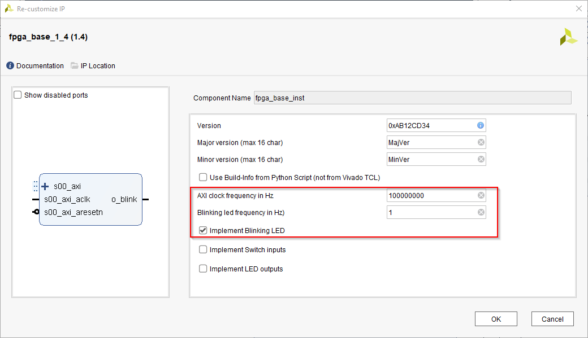

[<< back](06_ioctl_driver.md) | [index](01_index.md) | [forward >> ](99_references.md)

# Interrupts for UIO driver

## Overview

Interrupts are an essential functionality for embedded devices. So let's add an IRQ to our UIO driver example.

**Explanations in this section do not start from scratch but based on the state after the [UIO Driver Tutorial](./05_uio_driver).**

## 1. Add an Interrupt to the FPGA Design

First we need to add an IRQ to the FPGA design we can react on from the UIO driver and application. For this, we will modify the FPGA design that was created in the section [Setup](./03_setup.md).

First, we will change the *fpga_base* IP-Core to produce a 1Hz output signal. This signal is usually used for blinking LEDs, so it is named like this. But nothing prevents us from using this signal as IRQ. Note that we need to configure the correct clock frequency in order to get IRQs at exactly 1 Hz.

Next,  the ZYNQ7 processing system must be configured to accept interrupt inputs

Now, the new output from the IP-Core must be connected to the IRQ input of the PS. The figure below shows how your diagram should look now.

The changes are done now. Please follow the description in [Setup](./03_setup.md) to generate a new bitstream and produce a boot image from it.

## 2. Edit Device Tree

Compared to  [UIO Driver Tutorial](./05_uio_driver), the devicetree entry is modified as shown below:

<pre>
	uio_fpga_base@43C10000{
		status = "okay";
		compatible = "generic-uio";
		reg = < 0x43C10000 0x1000 >;
		<b>interrupt-parent = <&intc>;
		interrupts = <0x0 (61-32) 1></b>
	};
</pre>

What do these changes mean? 

* The *interrupts* property is built from a < X Y Z > tuple.

  * X = 1 for shared peripheral interrupts (SPI), 0 else3
  * Y = IRQ number (IRQnr - 32 for non SPI IRQs). In our case we use IRQ61 which is the first FPGA fabric IRQ in a Zynq-7000.
  * Z = IRQ type according to [linux/interrupt.h](https://github.com/torvalds/linux/blob/master/include/linux/interrupt.h). 1 is for rising-edge IRQs (IRQF_TRIGGER_RISING).

* The *interrupt-parent* property is a link to the device-tree node of the interrupt controller the IRQ is routed to. In our case, the node *intc* is defined in the include file *zynq-7000.dtsi* which is included in the main device-tree:

  <pre>
      ...
      <b>intc</b>: interrupt-controller@f8f01000 {
      	compatible = "arm,cortex-a9-gic"
      	#interrupt-cells = <3>
      	interrupt-controller;
      	reg = <0xF8F01000 0x1000>,
      	      <0xF8F00100 0x100>;
      }
      ...
  </pre>

  The full device-tree file is available in [[root]/uio_driver_irq/zx5-obru-uio-irq.dts](../uio_driver_irq/zx5-obru-uio-irq.dts)

## 3. Compile Device Tree

The easiest way to compile the edited devicetree, is copying it to the folder *[root]/bsp-xilinx/sources/xilinx-linux/arch/arm/boot/dts* directory of your Enclustra Build Environment.

The device-tree can then be compiled into a devicetree-blob using the command below (from within the *dts* drectiory mentioned above):

<pre>
dtc -O dtb -o zx5-obru-uio-irq.dtb zx5-obru-uio-irq.dts
</pre>

The output file *zx5-obru-uio-irq.dtb* must be copied to the boot partition of the SD card and renamed to *devicetree.dtb* (as expected by the boot process) and hence replace de default *devicetree.dtb* file.

## 4. Configure Kernel

This was done in [UIO Driver](05_uio_driver.md), so it is not explained again.

## 5. Installing Kernel Module

This was done in [UIO Driver](05_uio_driver.md), so it is not explained again.

## 6. Loading Kernel Module

The same steps as for [UIO Driver](05_uio_driver.md) are required. The command is repeated just to avoid that you have to switch documents because you do not remember the command:

<pre>
    modprobe uio_pdrv_genirq of_id="generic-uio"
</pre>

## 7. Getting Information about a UIO Device

The plain numbering of UIO devices without a human readable name can easily lead to confusion. Luckily, there are some ways to find out more about a UIO device.

One way to learn more about UIO devices is suing the */sys/class/uio* directory structure. For example:

<pre>
    # cat /sys/class/uio/uio0/name
    uio_fpga_base
</pre>

Another even more handy way, is the *lsuio* utility. It is not enabled by default but it can easily be enabled when configuring buildroot. Just search (using '/') for "lsuio" and enable the corresponding package. If *lsuio* is present you can use it as described below:

<pre>
    # lsuio
    uio0: name=uio_fpga_base, version=devicetree, events=<b>0</b>
            map[0]: addr=0x43C10000, size=4096
</pre>

The number of events is the total number of IRQs that was received by this device. So if you call *lsuio* after you received interrupts, this number may be different.

To find out whether the interrupt is configured correctly, we can execute the command below:

<pre>
    # cat /proc/interrupts
             CPU0   CPU1
    ...
    <b>47:	     21     0     GIC-0	61	Edge	uio_fpga_base</b>
    ...
</pre>

First we can see that the IRQ61 is registered for our device. We can also see how many IRQs were handled by each CPU (in this case 21 IRQs were handled by CPU0).

## 8. Write User Space Application

A small user space application is provided along with the example in order to show how to use the UIO driver with IRQs from user space. The application is provided as *Xilinx SDK* project. The source file can be found in [[root]/uio_driver_irq/app/src/helloworld.c](../uio_driver_irq/app/src/helloworld.c).

The program only has a hand full of lines and explanatory comments. So it is not described here in more detail. Just have a look at the sources.

To build the application, follow the steps below:

1. Start SDK
2. Create/choose an empty workspace
3. Click *File > Import*
4. Choose *General > Existing Projects into Workspace*
5. Select the folder *[root]/uio_driver_irq*
6. Press *Finish*

In SDK you should now see a project called *uio_test_irq*. By default SDK should automatically build the project and produce a *.elf file. If you disabled automatic build in SDK, you have to manually build the project using *Project > Build All*.

Now copy the *uio_test_irq.elf*  file to the directory */root/uio_driver_irq* of your SD Card (*rootfs* partition).

## 9. Test User Space Application

Follow the steps below to load the kernel module:

Boot the target device.

Then navigate to the correct directory on your *rootfs* ...

<pre>
    cd /root/uio_driver_irq
</pre>

... and start the application. Before, the driver must be loaded of course.

<pre>
    modprobe uio_pdrv_genirq of_id="generic-uio"
    ./uio_test_irq.elf
</pre>

You should now see the following output from your application:

<pre>
    Hello World
    version=0xAB12CD34
    year=2020
    sw-version=0x0000ABCD
    Received IRQ
    Received IRQ
    Received IRQ
    ...
</pre>

Note that the "year" output may change according to the year you built the FPGA bitstream in.

The *Received IRQ* messages pop up one after the other every second because an IRQ is detected every second. So our interrupts seem to work.

## 10. Conclusion

In this chapter, a simple UIO driver including IRQ was used. No kernel code was necessary to achieve this. Hence most FPGA IP can be supported this way without having to write drivers.

Of course only the very simplest case of a driver is covered, but this should be a good starting point to base your own development of a real (and more complex) driver on.

[<< back](06_ioctl_driver.md) | [index](01_index.md) | [forward >> ](99_references.md)