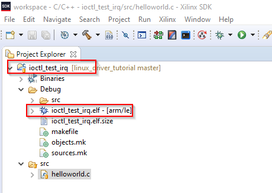

[<< back](07_uio_irq.md) | [index](01_index.md) | [forward >> ](99_references.md)

# Interrupts for IOCTL Driver

## Overview

Interrupts are an essential functionality for embedded devices. So let's add an IRQ to our IOCTLdriver example.

**Explanations in this section do not start from scratch but based on the state after the [IOCTL Driver Tutorial](./06_ioctl_driver).**

## 1. Add an Interrupt to the FPGA Design

**Please follow the steps described in [Interrupts for UIO Driver](07_uio_irq.md)**

The FPGA Design for both examples is the same. If you already build the design for the UIO example with IRQs, you do not have to modify it.

## 2. Edit Device Tree

First we have to let Linux know about our device. To do so, we edit the devicetree.

Details about location of devicetree files, how to build them, etc. can be found in the  [Enclustra Build Environment - HowTo Guide](https://download.enclustra.com/public_files/Design_Support/Application%20Notes/Enclustra_Build_Environment_HowToGuide_V02.pdf)

In our case, we add the section below to the default devicetree:

<pre>
    fpga_base@43C10000{	
		status = "okay";
		compatible = "psi,fpga-base";
		reg = < 0x43C10000 0x1000 >;
		somevalue = < 0x9876 >;
		<b>interrupt-parent = <&intc>;
		interrupts = <0x0 (61-32) 1></b>
	};
</pre>

The meaning of the lines added is described in detail in [Interrupts for UIO Driver](07_uio_irq.md). Therefore the description is omitted here.

The full device-tree file is available in [[root]/ioctl_driver_irq/zx5-obru-ioctl_irq.dts](../ioctl_driver_irq/zx5-obru-ioctl-irq.dts)

## 3. Compile Device Tree

The easiest way to compile the edited devicetree, is copying it to the folder *[root]/bsp-xilinx/sources/xilinx-linux/arch/arm/boot/dts* directory of your Enclustra Build Environment.

The device-tree can then be compiled into a devicetree-blob using the command below (from within the *dts* drectiory mentioned above):

<pre>
dtc -O dtb -o zx5-obru-ioctl-irq.dtb zx5-obru-ioctl-irq.dts
</pre>

The output file *zx5-obru-ioctl-irq.dtb* must be copied to the boot partition of the SD card and renamed to *devicetree.dtb* (as expected by the boot process) and hence replace de default *devicetree.dtb* file.

## 4. Write Kernel Module

The Kernel code from the IOCTL driver example without IRQ needs to be extended with functionality for registering the interrupt handling function, the interrupt handling function itself and IOCTL operations to interact with the interrupts.

Instead of describing any of the changes in detail here, explanatory comments were added to the code. So it is suggested that you read through the code.

* [[root]/ioctl_driver_irq/fpga_base_ioctl_irq.c](../ioctl_driver_irq/fpga_base_ioctl_irq.c)
* [[root]/ioctl_driver_irq/fpga_base_ioctl_irq.h](../ioctl_driver_irq/fpga_base_ioctl_irq.h)

The code certainly has some rough edges and it is not fully thread-safe. I decided to not clutter the code with many lines of kernel code in order to not obfuscate the things that are shown by this example: Registering and using an interrupt.

The concept for IRQ handling of this driver is, that a user space application calls an IOCTL (*WAIT_IRQ*) and is waked, when an interrupt arrives.

## 5. Compile Kernel Module

The details about how to build kernel modules for the Enclustra Embedded Build Environment are explained in *[Enclustra Build Environment - HowTo Guide](https://download.enclustra.com/public_files/Design_Support/Application%20Notes/Enclustra_Build_Environment_HowToGuide_V02.pdf) [2]*. 

A small script allowing building a driver with a single command is provided: [[root]/ioctl_driver_irq/compile.sh](../ioctl_driver_irq/compile.sh). The script is of course closely related to the makefile [[root]/ioctl_driver_irq/Makefile](../ioctl_driver_irq/Makefile). 

**Note that you must edit the _BSP_XILINX_ variable in the _compile.sh_ script to match your system before building the driver.**

To build the driver, just navigate to the *[root]/ioctl_driver_irq* directory and execute the follwoing command:

<pre>
    ./compile.sh
</pre>
Now copy the *fpga_base_ioctl_irq.ko* kernel object file to the directory */root/ioctl_driver_irq* of your SD Card (*rootfs* partition).

## 6. Load Kernel Module

Follow the steps below to load the kernel module:

Boot the target device.

Then navigate to the correct directory on your *rootfs* ...

<pre>
    cd /root/ioctl_driver_irq
</pre>

... and load the module

<pre>
    insmod fpga_base_ioctl_irq.ko
</pre>

You should now see the prints from the probe function:

<pre>
    Somevalue read from dt = 00009876
    Registering IRQ 47 in fpga_base
    Registered miscdev in fpga_base
</pre>

So the module was loaded and the corresponding devicetree entry was found. As a result the probe function was called. We can also see that the *somevalue* property was acquired from the devicetree correctly and that the interrupt was registered.

We can also see that the entry *fpga_base* popped up in the */dev* folder:

<pre>
    # ls /dev/fpga*
    /dev/fpga_base
</pre>

The name is defined in the driver-code:

<pre>
	...
    priv->mdev.name 	= "fpga_base";
    ...
</pre>

We can also see that a corresponding folder is added to *sys/class/misc* (becaue it is a miscdevice):

<pre>
    # cd /sys/class/misc
    # ls
    cpu_dma_latency     memory_bandwidth    ubi_ctrl
	<b>fpga_base</b>           network_latency     vga_arbiter
	loop-control        network_throughput  watchdog
</pre>
To find out whether the interrupt is configured correctly, we can execute the command below:

<pre>
    # cat /proc/interrupts
             CPU0   CPU1
    ...
    <b>47:	     3160   0     GIC-0	61	Edge	ufpga_base</b>
    ...
</pre>

First we can see that the IRQ61 is registered for our device. We can also see how many IRQs were handled by each CPU (in this case 3160 IRQs were handled by CPU0). The IRQ number at the very beginning of the line matches the print from the driver probe function (*Registering IRQ 47 in fpga_base*)

## 7. Write User Space Application

A small user space application is provided along with the example in order to show how to use the IOCTL driver including IRQs from user space. The application is provided as *Xilinx SDK* project. The source file can be found in [[root]/ioctl_driver_irq/app/src/helloworld.c](../ioctl_driver_irq/app/src/helloworld.c).

The program only has a hand full of lines and explanatory comments. So it is not described here in more detail. Just have a look at the sources.

To build the application, follow the steps below:

1. Start SDK
2. Create/choose an empty workspace
3. Click *File > Import*
4. Choose *General > Existing Projects into Workspace*
5. Select the folder *[root]/ioctl_irq_driver*
6. Press *Finish*

In SDK you should now see a project called *ioctl_test_irq*. By default SDK should automatically build the project and produce a *.elf file. If you disabled automatic build in SDK, you have to manually build the project using *Project > Build All*.

Now copy the *ioctl_test.elf*  file to the directory */root/ioctl_driver* of your SD Card (*rootfs* partition).

## 8. Test User Space Application

Follow the steps below to load the kernel module:

Boot the target device.

Then navigate to the correct directory on your *rootfs* ...

<pre>
    cd /root/ioctl_driver_irq
</pre>

... and start the application. Before, the driver must be loaded of course.

<pre>
    insmod ./fpga_base_ioctl_irq.ko
    ./ioctl_test_irq.elf
</pre>

You should now see the following output (containing user space *printf()* and *printk()* from the driver):

<pre>
    Hello World
    fpga_base open
    version=0xAB12CD34
    year=2020
    Sw Version = 123
    swversion=0x123
    Received IRQ
    Received IRQ
    ...
</pre>

The *Received IRQ* messages occur one after the other with one second space in between. They are triggered by the interrupt.

## 9. Conclusion

In this chapter, a simple IOCTL based device driver using IRQs was built and installed. It was used from a very simple user space application. 

Of course the IRQ handling within the driver is minimal for this simple example. However, it serves as a good starting point to write more complex drivers.

[<< back](07_uio_irq.md) | [index](01_index.md) | [forward >> ](99_references.md)